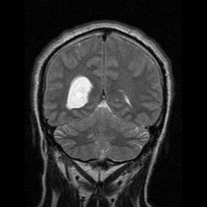

# Tumor-Segmentation

### Segmentation of Tumor Region in the Brain  
    1. Segmenting Tumor Regions in Brain MRI.
    2. Segmenting done using Thresholding and selecting high density areas.
    3. Dilation is performed on the image using 5x5 Structural Element.
    4. Tumor Region is highlighted with a border.
    
    
